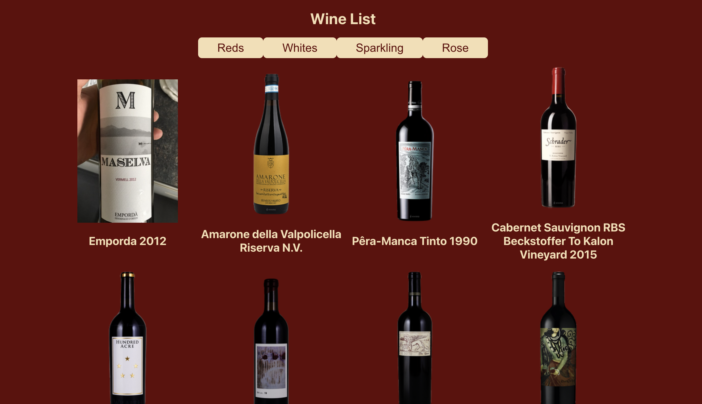

# Wine List App

Boca Code Week 5 Wine List App: We developed a Wine List app. The app allows you to explore different types of wines and view their details. 

## Features

- **Wine List**: Displays a list of wines based on their category, such as reds, whites, sparkling, and rose.
- **Wine Selection**: Users can select a specific category (reds, whites, sparkling, or rose) to filter the wines displayed.
- **Dynamic Content**: The app fetches wine data from an external API and dynamically updates the list based on the selected category.
- **Responsive Design**: The app is designed to be responsive and provides an optimal viewing experience across different devices.

## Technologies Used

- Javascript
- CSS
- React

## Getting Started

To run the Wine List app locally and explore the wine collection, follow these steps:

1. Clone the repository from [GitHub](https://github.com/[repository-url]).

2. Install the necessary dependencies using `npm install`.

3. Run the app using `npm start`.

## Usage

Once the app is running, you will see a selection of buttons representing different wines (reds, whites, sparkling, and rose). Clicking on a color button will update the list to display wines belonging to that specific color category. The wine list will dynamically update based on the selected type, and each wine card will display the wine's name and an accompanying image.

## Special Thanks

Special thanks to [Boca Code](https://github.com/bocacode) for providing the learning experience, resources, and support for this project.

---
*This project was developed as part of the Boca Code curriculum.*